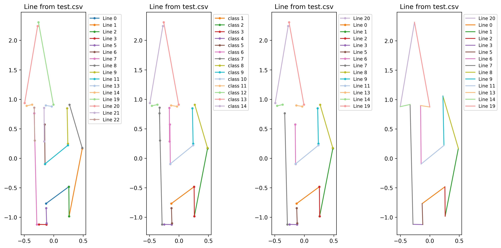

# Plane Object Vectorization

## Note

```cpp
// -*- coding：utf-8 -*-
// @Author: Peitong Li
// @Email: 2311797@tongji.edu.cn
// @Time: 2025/08/26
// @Dependent Project: https://github.com/peitonglee/PLV-SLAM.git
// @Description: PLV-SLAM: Vectorized Planar Object Modeling -- core code
```

## Getting Started

### environment 
cmake \
gcc  \
matplotlib_cpp (refer here: https://github.com/lava/matplotlib-cpp.git) \
python3 + matplotlib

### run
```
cd /path/to/PLV-SLAM/Plane_Obj_Vectorization
mkdir build && cd build
cmake ..
make
./Plane_Obj_Vectorization
```

### output
Plane_Obj_Vectorization/info/res/test.png \
Plane_Obj_Vectorization/info/res/test_box.png \
(The detailed results can be found in the info/res folder, See terminal console)

### Visualization
