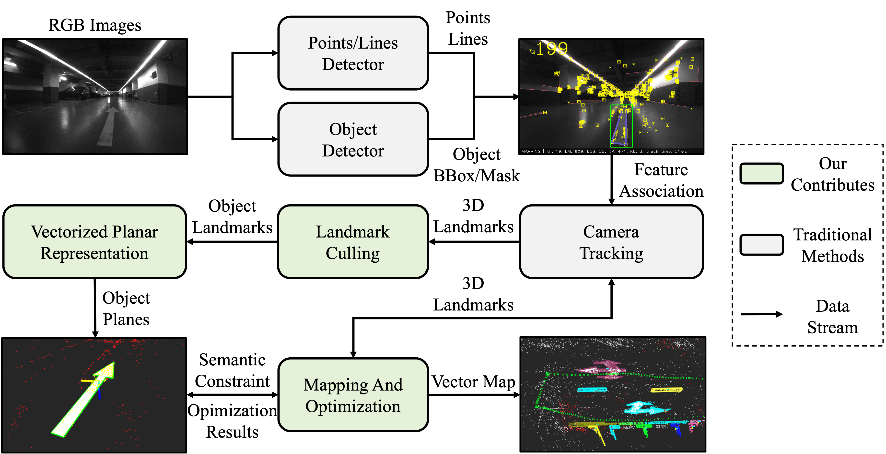
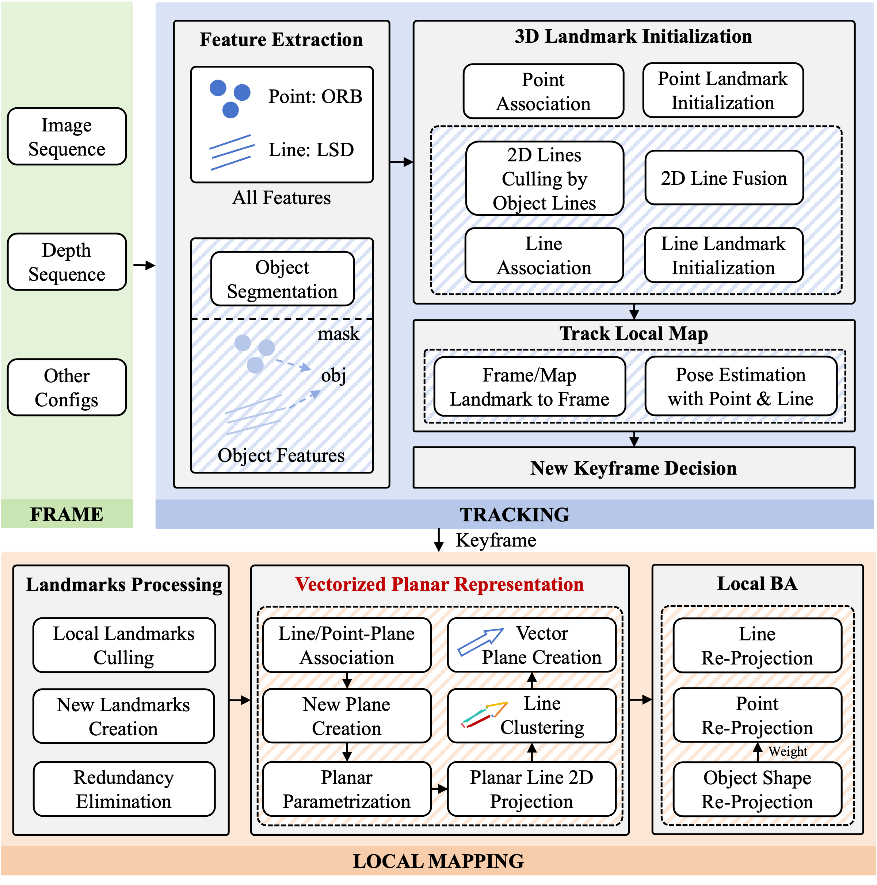
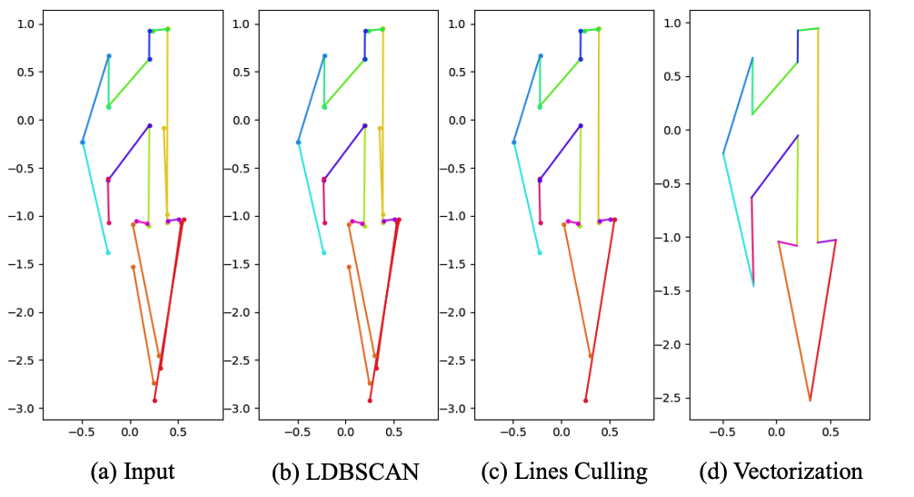
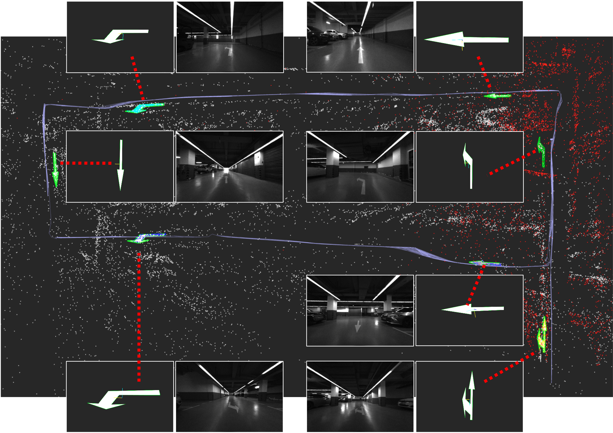
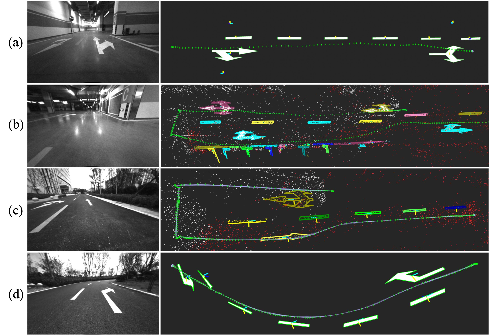
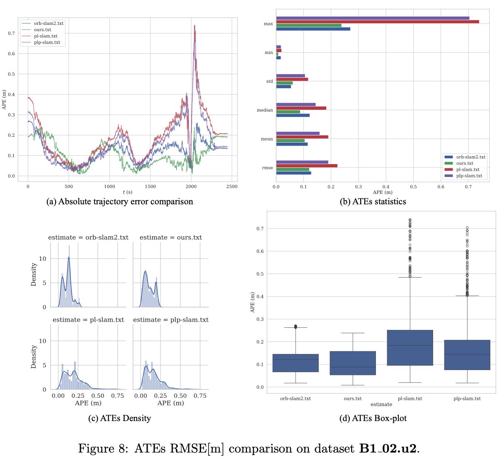
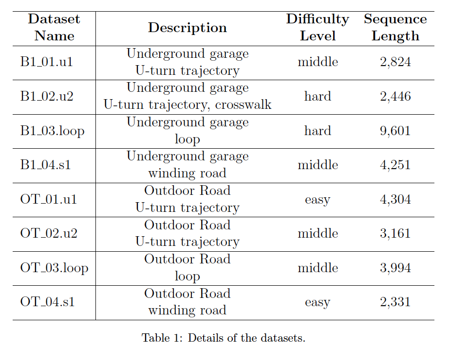

# PLV-SLAM: Real-Time Visual SLAM with Parametric Vectorized Planar Object Modeling for Geometric–Semantic Coupling

## Declaration
This work is currently being reviewed on "IEEE Transactions Automation Science and Engineering". The current version of the code is an offline version of the core code and can be used for testing and visualization. All the codes will be released after the paper is accepted.

## Related Works
[1] F. Shu, et al. "Structure PLP-SLAM: Efficient Sparse Mapping and Localization using Point, Line and Plane for Monocular, RGB-D and Stereo Cameras". IEEE International Conference on Robotics and Automation (ICRA), 2023. (https://arxiv.org/abs/2207.06058) updated arXiv v3 with supplementary materials. 

## Getting Started
Our work is based on PLP-SLAM, and all the code environments are the same as that of this project. ([code](https://github.com/peitonglee/Structure-PLP-SLAM-Backup.git))

### Plane_Obj_Vectorization demo
See [Here](https://github.com/peitonglee/PLV-SLAM/blob/main/Plane_Obj_Vectorization/README.md)

### Path_Planning_Base_Lines demo
See [Here](https://github.com/peitonglee/PLV-SLAM/blob/main/Path_Planning_Base_Lines/README.md)

## The Graphical Abstract

## The System Framework

## Vectorized Planar Object Modeling

## Mapping Visualization

## 轨迹估计

## The upcoming datasets (ARBT)

you can download the datasets from the following links: [ARBT](https://pan.baidu.com/s/1X5R5Zsw1R28wVPfbhbnoVg?pwd=7C0D)

